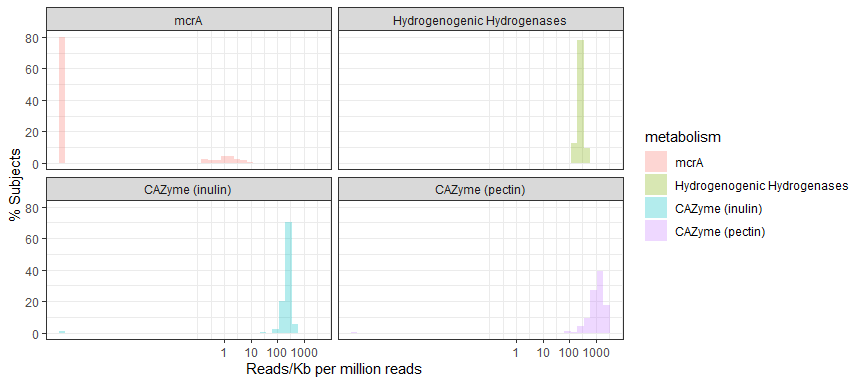

Rmarkdown file for all Figure 5d in the paper "Prebiotics and Community Composition Influence GasProduction of the Human Gut Microbiota"
================
Xiaoqian Yu, <xy43@mit.edu>, Twitter @seaweedomics, github.com/cusoiv
Aug 23rd 2020

-   [Load Libraries](#load-libraries)
-   [Read data](#read-data)
-   [Combine all counts and plot](#combine-all-counts-and-plot)

<style type="text/css">
h2{
  font-size: 18pt;
}
h3{
  font-size: 16pt;
}
h1.title{
  font-size: 24pt;
}


</style>
Load Libraries
--------------

``` r
library(ggplot2)
library(reshape)
```

Read data
---------

``` r
#Read hydrogenanse data
filelist_hyddb = Sys.glob("hyddb90/*.txt")
filelistname_hyddb=unlist(lapply(filelist_hyddb,function(x) strsplit(x,".",fixed=T)[[1]][1]))
datalist_hyddb = lapply(filelist_hyddb, function(x) read.table(x, fill=T,header=F))
datalist_hyddb_clean = lapply(datalist_hyddb, function(x) x[(x$V3>65) & (x$V4>25),])
hyddb_counts=unlist(lapply(datalist_hyddb_clean, function(x) nrow(x)))

#Read inulin cazyme data
filelist_inulin = Sys.glob("inulin90/*.txt")
filelistname_inulin=unlist(lapply(filelist_inulin,function(x) strsplit(x,".",fixed=T)[[1]][1]))
datalist_inulin = lapply(filelist_inulin, function(x) 
  if (file.size(x) > 0){read.table(x, fill=T,header=F)}
  else print(0))
datalist_inulin_clean = lapply(datalist_inulin, function(x) 
  if (x==0) {print (0)} #This will generate a lot of warnings b/c if file not empty this is a data.frame
  else {x[(x$V3>35) & (x$V4>25),]})
inulin_counts=unlist(lapply(datalist_inulin_clean, function(x) 
  if (is.data.frame(x)) {nrow(x)}
  else {0}))

#Read pectin cazyme data
filelist_pectin = Sys.glob("pectin90/*.txt")
filelistname_pectin=unlist(lapply(filelist_pectin,function(x) strsplit(x,".",fixed=T)[[1]][1]))
datalist_pectin = lapply(filelist_pectin, function(x) 
  if (file.size(x) > 0){read.table(x, fill=T,header=F)}
  else print(0))
datalist_pectin_clean = lapply(datalist_pectin, function(x) 
  if (x==0) {print (0)}  #This will generate a lot of warnings b/c if file not empty this is a data.frame
  else {x[(x$V3>35) & (x$V4>25),]})
pectin_counts=unlist(lapply(datalist_pectin_clean, function(x) 
  if (is.data.frame(x)) {nrow(x)}
  else {0}))

#Read mcrA data
filelist_metho = Sys.glob("metho90/*.txt")
filelistname_metho=unlist(lapply(filelist_metho,function(x) strsplit(x,".",fixed=T)[[1]][1]))

datalist_metho = lapply(filelist_metho, function(x) 
  if (file.size(x) > 0){read.table(x, fill=T,header=F)}
  else print(0))
datalist_metho_clean = lapply(datalist_metho, function(x) 
  if (x==0) {print (0)} #This will generate a lot of warnings b/c if file not empty this is a data.frame
  else {x[(x$V3>65) & (x$V4>25),]})
metho_counts=unlist(lapply(datalist_metho_clean, function(x) 
  if (is.data.frame(x)) {nrow(x)}
  else {0}))

#Read gene length data
gene_length=read.csv('gene_length.csv',row.names = 1)
```

Combine all counts and plot
---------------------------

``` r
sample_counts=as.data.frame(metho_counts)
sample_counts$hyddb_counts=hyddb_counts
sample_counts$inulin_counts=inulin_counts[1:176]
sample_counts$pectin_counts=pectin_counts[1:176]
sample_counts=sample_counts[1:160,]  #eventually only used 160 of all the datasets

sample_counts$mcrA=sample_counts$metho_counts/((gene_length$average_read_length[5]/1000)*20)+0.000001
sample_counts$`Hydrogenogenic Hydrogenases`=sample_counts$hyddb_counts/((gene_length$average_read_length[4]/1000)*20)+0.000001
sample_counts$`CAZyme (inulin)`=sample_counts$inulin_counts/((gene_length$average_read_length[2]/1000)*20)+0.000001
sample_counts$`CAZyme (pectin)`=sample_counts$pectin_counts/((gene_length$average_read_length[3]/1000)*20)+0.000001
melt_sample_counts=melt(sample_counts[,c(5:8)])
```

    ## Using  as id variables

``` r
names(melt_sample_counts)=c('metabolism','Reads/Kb per million reads')


hist_all=ggplot(melt_sample_counts, aes(x=`Reads/Kb per million reads`,fill=metabolism,y = 100*4*(..count..)/sum(..count..))) +
  geom_histogram(alpha=0.3,bins=40)+ 
  scale_x_log10("Reads/Kb per million reads", breaks=c(0,1,10,100,1000))+
  scale_y_continuous('% Subjects')+
  facet_wrap( ~ metabolism,nrow=2)+theme_bw()

hist_all
```


