Rmarkdown file for all Figures(except Figure 5d) in the paper "Prebiotics and Community Composition Influence GasProduction of the Human Gut Microbiota"
================
Xiaoqian Yu, <xy43@mit.edu>, Twitter @seaweedomics, github.com/cusoiv
Aug 23rd 2020

-   [Load Libraries](#load-libraries)
-   [Import Data](#import-data)
-   [Find basis vectors for inulin and pectin](#find-basis-vectors-for-inulin-and-pectin)
-   [Clean Gas data](#clean-gas-data)
-   [Some colors](#some-colors)
-   [Set seed](#set-seed)
-   [Figure 1c, S1](#figure-1c-s1)
    -   [Prepare](#prepare)
    -   [Figure S1, Draw all hulls in 2D](#figure-s1-draw-all-hulls-in-2d)
    -   [Figure 1c, select figures involving H2 and CO2](#figure-1c-select-figures-involving-h2-and-co2)
-   [Figure S2](#figure-s2)
    -   [Prepare](#prepare-1)
    -   [Plot Figure S2a, S2b, S2c](#plot-figure-s2a-s2b-s2c)
-   [Figure 3a](#figure-3a)
-   [Figure 3c](#figure-3c)
-   [Figure 2b](#figure-2b)
-   [Figure 4,Figure S3](#figure-4figure-s3)
-   [Figure S6a, S6b](#figure-s6a-s6b)
-   [Figure 5a, S5](#figure-5a-s5)
-   [Figure 5b](#figure-5b)
-   [Figure S4](#figure-s4)

<style type="text/css">
h2{
  font-size: 18pt;
}
h3{
  font-size: 16pt;
}
h1.title{
  font-size: 24pt;
}


</style>
Load Libraries
--------------

``` r
library(rcdd)   #convert between different polytopes
library(pracma)
library(Matrix)
library(ggplot2)
library(RColorBrewer)
library(ggpubr)
library(cowplot)
library(grid)
library(gridExtra)
library(plyr)
library(dplyr)
library(phyloseq)
library(reshape2)
library(glmnet)
library(tibble)
library(rfUtilities)
library(vegan)
```

Import Data
-----------

``` r
#Read in M matrix for Inulin and Pectin
balance_G=read.csv('inulin_balance_new.csv',row.names = 1)
balance_P=read.csv('pectin_balance_new.csv',row.names = 1)

#Read in Gas data
gas_prod_9ppl_mean=read.csv('gas_scfa_mmol_R.csv',row.names = 1)
gas_prod_9ppl_sd=read.csv('gas_scfa_mmol_R_sd.csv',row.names = 1)   #Need to make all imports consistent 

# Read in 16S data 

full_dataset=readRDS('gas_9ppl.rds')
taxa_table=read.csv('taxa_species_use.csv',row.names = 1)
taxa_table=as.matrix(taxa_table)
rownames(full_dataset)=gsub("_F_filt.fastq.gz","",rownames(full_dataset))
gas_9ppl=full_dataset[grep('GC',rownames(full_dataset)),]
```

Find basis vectors for inulin and pectin
----------------------------------------

``` r
#Inulin
balance_GM=as.matrix(balance_G)

nullG=null(balance_GM)
mBG=-1./nullG[1,]
nullG_2=nullG %*% diag(mBG)  #normalize so that first row is -1

#Pectin
balance_PM=as.matrix(balance_P)

nullP=null(balance_PM)
mBP=-1./nullP[1,]
nullP_2=nullP %*% diag(mBP) #normalize so that first row is -1
```

Clean Gas data
--------------

``` r
gas_prod_9ppl_mean$gas=gas_prod_9ppl_mean$H2+gas_prod_9ppl_mean$CH4+gas_prod_9ppl_mean$CO2
gas_prod_9ppl_Cell=gas_prod_9ppl_mean[1:9,]
gas_prod_9ppl_Inu=gas_prod_9ppl_mean[10:18,]
gas_prod_9ppl_Pect=gas_prod_9ppl_mean[19:27,]

gas_prod_9ppl_Cell_mol=gas_prod_9ppl_Cell/gas_prod_9ppl_Cell$Fiber_uptake
gas_prod_9ppl_Inu_mol=gas_prod_9ppl_Inu/gas_prod_9ppl_Inu$Fiber_uptake
gas_prod_9ppl_Pect_mol=gas_prod_9ppl_Pect/gas_prod_9ppl_Pect$Fiber_uptake
gas_prod_9ppl_mol=gas_prod_9ppl_mean/gas_prod_9ppl_mean$Fiber_uptake

gas_prod_9ppl_sd$gas=(gas_prod_9ppl_sd$H2^2+gas_prod_9ppl_sd$CH4^2+gas_prod_9ppl_sd$CO2^2)^0.5
gas_prod_9ppl_Cell_sd=gas_prod_9ppl_sd[1:9,]
gas_prod_9ppl_Inu_sd=gas_prod_9ppl_sd[10:18,]
gas_prod_9ppl_Pect_sd=gas_prod_9ppl_sd[19:27,]

gas_prod_9ppl_Cell_mol_sd=gas_prod_9ppl_Cell_sd/gas_prod_9ppl_Cell_sd$Fiber_uptake
gas_prod_9ppl_Inu_mol_sd=gas_prod_9ppl_Inu_sd/gas_prod_9ppl_Inu_sd$Fiber_uptake
gas_prod_9ppl_Pect_mol_sd=gas_prod_9ppl_Pect_sd/gas_prod_9ppl_Pect_sd$Fiber_uptake
gas_prod_9ppl_mol_sd=gas_prod_9ppl_sd/gas_prod_9ppl_sd$Fiber_uptake

gas_prod_9ppl_Inu_mol_plus_sd=gas_prod_9ppl_Inu_mol+gas_prod_9ppl_Inu_mol_sd
gas_prod_9ppl_Inu_mol_minus_sd=gas_prod_9ppl_Inu_mol-gas_prod_9ppl_Inu_mol_sd

gas_prod_9ppl_Inu_mol_combined_sd=merge.data.frame(gas_prod_9ppl_Inu_mol_plus_sd,gas_prod_9ppl_Inu_mol_minus_sd,by=0)
gas_prod_9ppl_Inu_mol_combined_sd=merge.data.frame(gas_prod_9ppl_Inu_mol,gas_prod_9ppl_Inu_mol_combined_sd,by.x=0,by.y = "Row.names")

gas_prod_9ppl_Pect_mol_plus_sd=gas_prod_9ppl_Pect_mol+gas_prod_9ppl_Pect_mol_sd
gas_prod_9ppl_Pect_mol_minus_sd=gas_prod_9ppl_Pect_mol-gas_prod_9ppl_Pect_mol_sd
gas_prod_9ppl_Pect_mol_combined_sd=merge.data.frame(gas_prod_9ppl_Pect_mol_plus_sd,gas_prod_9ppl_Pect_mol_minus_sd,by=0)
gas_prod_9ppl_Pect_mol_combined_sd=merge.data.frame(gas_prod_9ppl_Pect_mol,gas_prod_9ppl_Pect_mol_combined_sd,by.x=0,by.y = "Row.names")
```

Some colors
-----------

``` r
alpha_blue=alpha('deepskyblue4',0.3)
alpha_blue_1=alpha('deepskyblue4',0.4)
alpha_blue_2=alpha('deepskyblue4',0.8)
alpha_blue_3=alpha('deepskyblue4',0.6)
alpha_red=alpha('coral',0.3)
alpha_red_1=alpha('coral',0.4)
alpha_red_2=alpha('coral',0.8)
alpha_red_3=alpha('coral',0.6)
```

Set seed
--------

``` r
#as.numeric(Sys.time())  #1531161005
set.seed(1531161005)
```

Figure 1c, S1
-------------

### Prepare

``` r
#write conditions that need to be satisfied as A1x<b1, A2x=b2
aG1=nullG_2[c(2:9),]*-1  #now convert so that nullG_2 first row normalizes to 1, this is b/c our conditions are actually >0 instead of <0, so we are writing as -A1x<-b1 
aG2=nullG_2[1,]*-1  #-A2x=1
bG1=c(0,0,0,0,0,0,0,0)
bG2=1
G_H=makeH(aG1, bG1, aG2, bG2, x = NULL)
outG1 <- scdd(d2q(G_H), inputincidence = TRUE, representation = "H")
out_G=q2d(outG1$output)[,c(-1,-2)]
PG1=rbind(aG2,aG1) %*% t(out_G)*(-1)
PG1=as.data.frame(t(PG1))
names(PG1)=names(balance_G)[1:9]


aP1=nullP_2[c(2:9),]*-1
aP2=nullP_2[1,]*-1
bP1=c(0,0,0,0,0,0,0,0)
bP2=1
P_H=makeH(aP1, bP1, aP2, bP2, x = NULL)
out1 <- scdd(d2q(P_H), inputincidence = TRUE, representation = "H")
out_P=q2d(out1$output)[,c(-1,-2)]
PP1=rbind(aP2,aP1) %*% t(out_P)*(-1)
PP1=as.data.frame(t(PP1))
names(PP1)=names(balance_P)[1:9]
```

### Figure S1, Draw all hulls in 2D

``` r
PG1_rename=PG1
PP1_rename=PP1
names(PG1_rename)[6]="Carbon dioxide"
names(PP1_rename)[6]="Carbon dioxide"
names(PG1_rename)[7]="Hydrogen Gas"
names(PP1_rename)[7]="Hydrogen Gas"


hull_plot_list_0=list()
for (i in 2:9){
  for (j in 2:9){
    g1_hull_G_ij=chull(PG1[,i],PG1[,j])
    g1_hull_G_ij <- c(g1_hull_G_ij, g1_hull_G_ij[1])
    g1_hull_P_ij=chull(PP1[,i],PP1[,j])
    g1_hull_P_ij <- c(g1_hull_P_ij, g1_hull_P_ij[1])
    
    g_hull_0=ggplot(PG1, aes_string(x=names(PG1)[i],y=names(PG1)[j]))+
  geom_polygon(data=PG1[g1_hull_G_ij,],fill=alpha_blue,linetype=1,color=alpha_blue_1,size=1)+
  geom_polygon(data=PP1[g1_hull_P_ij,],fill=alpha_red,linetype=1,color=alpha_red_1,size=1)+theme_bw()+
  labs(x=names(PG1_rename)[i],y=names(PG1_rename)[j])+
  theme(axis.text=element_text(size=5),axis.title=element_text(size=5))+
      scale_x_continuous(limits=c(-0.01,max(PG1[g1_hull_G_ij,i])+0.5))+
      scale_y_continuous(limits=c(-0.01,max(PG1[g1_hull_G_ij,j])+0.5))
                           
  if (i!=j){
  hull_plot_list_0[[8*(i-2)+(j-1)]]=g_hull_0  
  }
  }
  
}

p=plot_grid(plotlist=hull_plot_list_0,ncol=8)

p
```

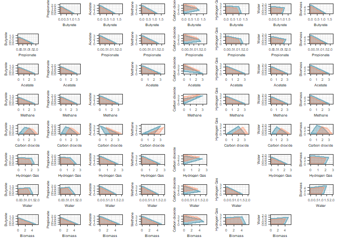

### Figure 1c, select figures involving H2 and CO2

``` r
#Hulls in 2D

g1_hull_G_0=chull(PG1$Hydrogen.gas,PG1$Acetate)
g1_hull_G_0 <- c(g1_hull_G_0, g1_hull_G_0[1])
g1_hull_P_0=chull(PP1$Hydrogen.gas,PP1$Acetate)
g1_hull_P_0 <- c(g1_hull_P_0, g1_hull_P_0[1])


g2_hull_G_0=chull(PG1$Hydrogen.gas,PG1$Butyrate)
g2_hull_G_0 <- c(g2_hull_G_0, g2_hull_G_0[1])
g2_hull_P_0=chull(PP1$Hydrogen.gas,PP1$Butyrate)
g2_hull_P_0 <- c(g2_hull_P_0, g2_hull_P_0[1])

g3_hull_G_0=chull(PG1$Hydrogen.gas,PG1$Propionate)
g3_hull_G_0 <- c(g3_hull_G_0, g3_hull_G_0[1])
g3_hull_P_0=chull(PP1$Hydrogen.gas,PP1$Propionate)
g3_hull_P_0 <- c(g3_hull_P_0, g3_hull_P_0[1])


g4_hull_G_0=chull(PG1$Carbon.dioxide,PG1$Acetate)
g4_hull_G_0 <- c(g4_hull_G_0, g4_hull_G_0[1])
g4_hull_P_0=chull(PP1$Carbon.dioxide,PP1$Acetate)
g4_hull_P_0 <- c(g4_hull_P_0, g4_hull_P_0[1])


g5_hull_G_0=chull(PG1$Carbon.dioxide,PG1$Butyrate)
g5_hull_G_0 <- c(g5_hull_G_0, g5_hull_G_0[1])
g5_hull_P_0=chull(PP1$Carbon.dioxide,PP1$Butyrate)
g5_hull_P_0 <- c(g5_hull_P_0, g5_hull_P_0[1])


g6_hull_G_0=chull(PG1$Carbon.dioxide,PG1$Propionate)
g6_hull_G_0 <- c(g6_hull_G_0, g6_hull_G_0[1])
g6_hull_P_0=chull(PP1$Carbon.dioxide,PP1$Propionate)
g6_hull_P_0 <- c(g6_hull_P_0, g6_hull_P_0[1])

g_H2_Acetate_0=ggplot(data=PP1,aes(x=Hydrogen.gas, y=Acetate))+
  geom_polygon(data=PG1[g1_hull_G_0,],fill=alpha_blue,linetype=1,color=alpha_blue_1,size=1)+
  geom_polygon(data=PP1[g1_hull_P_0,],fill=alpha_red,linetype=1,color=alpha_red_1,size=1)+theme_bw()+
  labs(x=expression('Mols' ~H[2]),y='Mols Acetate')+
  theme(axis.text=element_text(size=12),axis.title=element_text(size=14))

g_H2_Butyrate_0=ggplot(data=PP1,aes(x=Hydrogen.gas, y=Butyrate))+
  geom_polygon(data=PG1[g2_hull_G_0,],fill=alpha_blue,linetype=1,color=alpha_blue_1,size=1)+
  geom_polygon(data=PP1[g2_hull_P_0,],fill=alpha_red,linetype=1,color=alpha_red_1,size=1)+theme_bw()+
  labs(x=expression('Mols' ~H[2]),y='Mols Butyrate')+
  theme(axis.text=element_text(size=12),axis.title=element_text(size=14))

g_H2_Propionate_0=ggplot(data=PP1,aes(x=Hydrogen.gas, y=Propionate))+
  geom_polygon(data=PG1[g3_hull_G_0,],fill=alpha_blue,linetype=1,color=alpha_blue_1,size=1)+
  geom_polygon(data=PP1[g3_hull_P_0,],fill=alpha_red,linetype=1,color=alpha_red_1,size=1)+theme_bw()+
  labs(x=expression('Mols' ~H[2]),y='Mols Propionate')+
  theme(axis.text=element_text(size=12),axis.title=element_text(size=14))

g_CO2_Acetate_0=ggplot(PP1, aes(x =Carbon.dioxide, y = Acetate))+
  geom_polygon(data=PG1[g4_hull_G_0,],fill=alpha_blue,linetype=1,color=alpha_blue_1,size=1)+
  geom_polygon(data=PP1[g4_hull_P_0,],fill=alpha_red,linetype=1,color=alpha_red_1,size=1)+theme_bw()+
  labs(x=expression('Mols' ~CO[2]),y='Mols Acetate')+
  theme(axis.text=element_text(size=12),axis.title=element_text(size=14))

g_CO2_Butyrate_0=ggplot(PP1, aes(x =Carbon.dioxide, y = Butyrate))+
  geom_polygon(data=PG1[g5_hull_G_0,],fill=alpha_blue,linetype=1,color=alpha_blue_1,size=1)+
  geom_polygon(data=PP1[g5_hull_P_0,],fill=alpha_red,linetype=1,color=alpha_red_1,size=1)+theme_bw()+
  labs(x=expression('Mols' ~CO[2]),y='Mols Butyrate')+
  theme(axis.text=element_text(size=12),axis.title=element_text(size=14))

g_CO2_Propionate_0=ggplot(PP1, aes(x =Carbon.dioxide, y = Propionate))+
  geom_polygon(data=PG1[g6_hull_G_0,],fill=alpha_blue,linetype=1,color=alpha_blue_1,size=1)+
  geom_polygon(data=PP1[g6_hull_P_0,],fill=alpha_red,linetype=1,color=alpha_red_1,size=1)+theme_bw()+
  labs(x=expression('Mols' ~CO[2]),y='Mols Propionate')+
  theme(axis.text=element_text(size=12),axis.title=element_text(size=14))


plot_grid(g_H2_Acetate_0, g_H2_Butyrate_0,g_H2_Propionate_0,
          g_CO2_Acetate_0,g_CO2_Butyrate_0,g_CO2_Propionate_0,ncol=3,align = 'v')
```

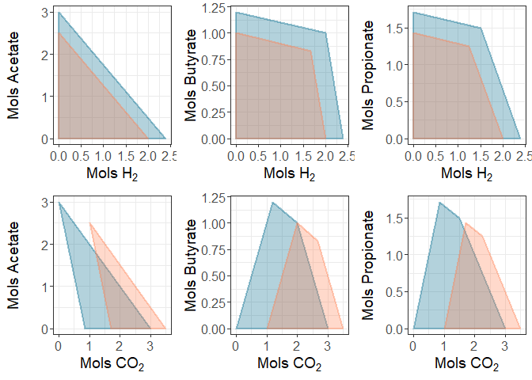

Figure S2
---------

### Prepare

``` r
#What if we restrict the yield of biomass to be 0.15?
aG1_y=nullG_2[c(2:8),]*-1  #now convert so that nullG_2 first row normalizes to 1, this is b/c our conditions are actually >0 instead of <0, so we are writing as -A1x<-b1 
aG2_y=nullG_2[c(1,9),]*-1  #-A2x=1
bG1_y=c(0,0,0,0,0,0,0)
bG2_y=c(1,-0.9) #6*0.15=0.9, carbon is limiting
G_H_y=makeH(aG1_y, bG1_y, aG2_y, bG2_y, x = NULL)
outG1_y <- scdd(d2q(G_H_y), inputincidence = TRUE, representation = "H")
out_G_y=q2d(outG1_y$output)[,c(-1,-2)]
PG1_y=rbind(aG2_y,aG1_y) %*% t(out_G_y)*(-1)
PG1_y=as.data.frame(t(PG1_y))
PG1_y=PG1_y[,c(1,3:9,2)]
names(PG1_y)=names(balance_G)[1:9]

aP1_y=nullP_2[c(2:8),]*-1  #now convert so that nullG_2 first row normalizes to 1, this is b/c our conditions are actually >0 instead of <0, so we are writing as -A1x<-b1 
aP2_y=nullP_2[c(1,9),]*-1  #-A2x=1
bP1_y=c(0,0,0,0,0,0,0)
bP2_y=c(1,-0.9)  #6*0.15=0.9, carbon is limiting
P_H_y=makeH(aP1_y, bP1_y, aP2_y, bP2_y, x = NULL)
outP1_y <- scdd(d2q(P_H_y), inputincidence = TRUE, representation = "H")
out_P_y=q2d(outP1_y$output)[,c(-1,-2)]
PP1_y=rbind(aP2_y,aP1_y) %*% t(out_P_y)*(-1)
PP1_y=as.data.frame(t(PP1_y))
PP1_y=PP1_y[,c(1,3:9,2)]
names(PP1_y)=names(balance_P)[1:9]
```

### Plot Figure S2a, S2b, S2c

``` r
hull_plot_list_y0_G=list()
hull_plot_list_y0_P=list()
hull_plot_list_y0=list()
for (i in 2:9){
  for (j in 2:9){
    g1_hull_G_ij_y=chull(PG1_y[,i],PG1_y[,j])
    g1_hull_G_ij_y <- c(g1_hull_G_ij_y, g1_hull_G_ij_y[1])
    g1_hull_P_ij_y=chull(PP1_y[,i],PP1_y[,j])
    g1_hull_P_ij_y <- c(g1_hull_P_ij_y, g1_hull_P_ij_y[1])
    
    g1_hull_G_ij=chull(PG1[,i],PG1[,j])
    g1_hull_G_ij <- c(g1_hull_G_ij, g1_hull_G_ij[1])
    g1_hull_P_ij=chull(PP1[,i],PP1[,j])
    g1_hull_P_ij <- c(g1_hull_P_ij, g1_hull_P_ij[1])   
    
    
    g_hull_y0_G=ggplot(PG1_y, aes_string(x=names(PG1_y)[i],y=names(PG1_y)[j]))+
  geom_polygon(data=PG1[g1_hull_G_ij,],fill=alpha_blue,linetype=1,color=alpha_blue_1,size=1)+
  geom_polygon(data=PG1_y[g1_hull_G_ij_y,],fill=alpha_blue_2,linetype=1,color=alpha_blue_2,size=1)+theme_bw()+
  labs(x=names(PG1_rename)[i],y=names(PG1_rename)[j])+
  theme(axis.text=element_text(size=5),axis.title=element_text(size=5))+
      scale_x_continuous(limits=c(-0.01,max(PG1[g1_hull_G_ij,i])+0.5))+
      scale_y_continuous(limits=c(-0.01,max(PG1[g1_hull_G_ij,j])+0.5))
    
    g_hull_y0_P=ggplot(PP1_y, aes_string(x=names(PP1_y)[i],y=names(PP1_y)[j]))+
  geom_polygon(data=PP1[g1_hull_P_ij,],fill=alpha_red,linetype=1,color=alpha_red_1,size=1)+
  geom_polygon(data=PP1_y[g1_hull_P_ij_y,],fill=alpha_red_2,linetype=1,color=alpha_red_2,size=1)+theme_bw()+
  labs(x=names(PP1_rename)[i],y=names(PP1_rename)[j])+
  theme(axis.text=element_text(size=5),axis.title=element_text(size=5))+
      scale_x_continuous(limits=c(-0.01,max(PG1[g1_hull_G_ij,i])+0.5))+
      scale_y_continuous(limits=c(-0.01,max(PG1[g1_hull_G_ij,j])+0.5))
    
    g_hull_y0=ggplot(PG1_y, aes_string(x=names(PG1_y)[i],y=names(PG1_y)[j]))+
  geom_polygon(data=PG1_y[g1_hull_G_ij_y,],fill=alpha_blue_2,linetype=1,color=alpha_blue_2,size=1)+
  geom_polygon(data=PP1_y[g1_hull_P_ij_y,],fill=alpha_red_2,linetype=1,color=alpha_red_2,size=1)+theme_bw()+
  labs(x=names(PG1_rename)[i],y=names(PG1_rename)[j])+
  theme(axis.text=element_text(size=5),axis.title=element_text(size=5))+
      scale_x_continuous(limits=c(-0.01,max(PG1[g1_hull_G_ij,i])+0.5))+
      scale_y_continuous(limits=c(-0.01,max(PG1[g1_hull_G_ij,j])+0.5))
      
  if (i!=j){
  hull_plot_list_y0_G[[8*(i-2)+(j-1)]]=g_hull_y0_G
  hull_plot_list_y0_P[[8*(i-2)+(j-1)]]=g_hull_y0_P
  hull_plot_list_y0[[8*(i-2)+(j-1)]]=g_hull_y0
  
  }
  }
  
}

py_G=plot_grid(plotlist=hull_plot_list_y0_G,ncol=8)
py_P=plot_grid(plotlist=hull_plot_list_y0_P,ncol=8)
py=plot_grid(plotlist=hull_plot_list_y0,ncol=8)

py
```

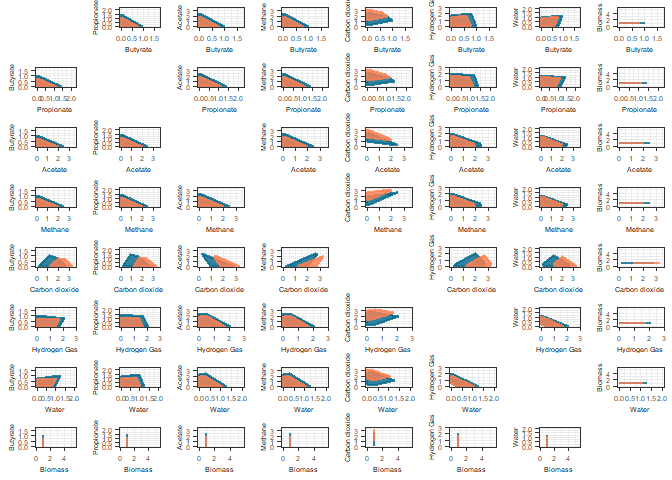

``` r
py_G
```

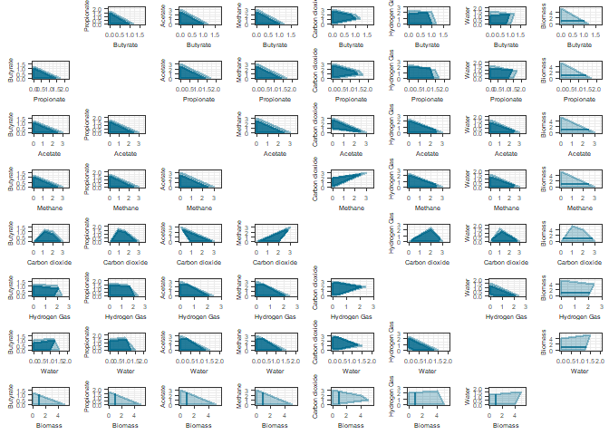

``` r
py_P
```

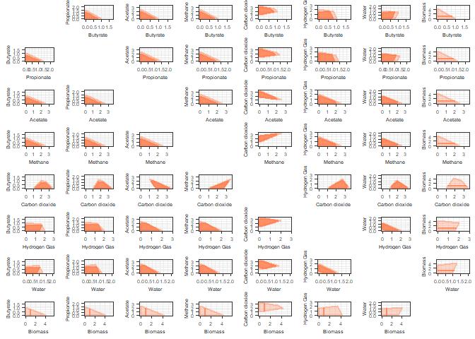

Figure 3a
---------

``` r
#Compare experimental data points to theoretical range
g_H2_Acetate_actual_0=ggplot(data=PP1,aes(x=Hydrogen.gas, y=Acetate))+
  geom_polygon(data=PG1[g1_hull_G_0,],fill=alpha_blue,linetype=1,color=alpha_blue_1,size=1)+
  geom_polygon(data=PP1[g1_hull_P_0,],fill=alpha_red,linetype=1,color=alpha_red_1,size=1)+theme_bw()+
  geom_point(data=gas_prod_9ppl_Inu_mol_combined_sd,aes(x=H2,y=Acetate),color='deepskyblue4',pch=19)+
  geom_errorbar(data=gas_prod_9ppl_Inu_mol_combined_sd,aes(x=H2,ymin=Acetate.y,ymax=Acetate.x),color=alpha_blue_1,width=0)+
  geom_errorbarh(data=gas_prod_9ppl_Inu_mol_combined_sd,aes(y=Acetate,xmin=H2.y, xmax=H2.x,height=0),
                 inherit.aes = FALSE,color=alpha_blue_1)+
  geom_point(data=gas_prod_9ppl_Pect_mol_combined_sd,aes(x=H2,y=Acetate),color='coral',pch=19)+
  geom_errorbar(data=gas_prod_9ppl_Pect_mol_combined_sd,aes(x=H2,ymin=Acetate.y,ymax=Acetate.x),color=alpha_red_1,width=0)+
  geom_errorbarh(data=gas_prod_9ppl_Pect_mol_combined_sd,aes(y=Acetate,xmin=H2.y, xmax=H2.x,height=0),
                inherit.aes = FALSE,color=alpha_red_1)+
  labs(x=expression('Mols' ~H[2]),y='Mols Acetate')+
  theme(axis.text=element_text(size=12),axis.title=element_text(size=14))

g_H2_Butyrate_actual_0=ggplot(data=PP1,aes(x=Hydrogen.gas, y=Butyrate))+
  geom_polygon(data=PG1[g2_hull_G_0,],fill=alpha_blue,linetype=1,color=alpha_blue_1,size=1)+
  geom_polygon(data=PP1[g2_hull_P_0,],fill=alpha_red,linetype=1,color=alpha_red_1,size=1)+theme_bw()+
  geom_point(data=gas_prod_9ppl_Inu_mol_combined_sd,aes(x=H2,y=Butyrate),color='deepskyblue4',pch=19)+
  geom_errorbar(data=gas_prod_9ppl_Inu_mol_combined_sd,aes(x=H2,ymin=Butyrate.y,ymax=Butyrate.x),color=alpha_blue_1,width=0)+
  geom_errorbarh(data=gas_prod_9ppl_Inu_mol_combined_sd,aes(y=Butyrate,xmin=H2.y, xmax=H2.x,height=0),
                inherit.aes = FALSE,color=alpha_blue_1)+
  geom_point(data=gas_prod_9ppl_Pect_mol_combined_sd,aes(x=H2,y=Butyrate),color='coral',pch=19)+
  geom_errorbar(data=gas_prod_9ppl_Pect_mol_combined_sd,aes(x=H2,ymin=Butyrate.y,ymax=Butyrate.x),color=alpha_red_1,width=0)+
  geom_errorbarh(data=gas_prod_9ppl_Pect_mol_combined_sd,aes(y=Butyrate,xmin=H2.y, xmax=H2.x,height=0),
                inherit.aes = FALSE,color=alpha_red_1)+
  labs(x=expression('Mols' ~H[2]),y='Mols Butyrate')+
  theme(axis.text=element_text(size=12),axis.title=element_text(size=14))

g_H2_Propionate_actual_0=ggplot(data=PP1,aes(x=Hydrogen.gas, y=Propionate))+
  geom_polygon(data=PG1[g3_hull_G_0,],fill=alpha_blue,linetype=1,color=alpha_blue_1,size=1)+
  geom_polygon(data=PP1[g3_hull_P_0,],fill=alpha_red,linetype=1,color=alpha_red_1,size=1)+theme_bw()+
  geom_point(data=gas_prod_9ppl_Inu_mol_combined_sd,aes(x=H2,y=Propionate),color='deepskyblue4',pch=19)+
  geom_errorbar(data=gas_prod_9ppl_Inu_mol_combined_sd,aes(x=H2,ymin=Propionate.y,ymax=Propionate.x),color=alpha_blue_1,width=0)+
  geom_errorbarh(data=gas_prod_9ppl_Inu_mol_combined_sd,aes(y=Propionate,xmin=H2.y, xmax=H2.x,height=0),
                inherit.aes = FALSE,color=alpha_blue_1)+
  geom_point(data=gas_prod_9ppl_Pect_mol_combined_sd,aes(x=H2,y=Propionate),color='coral',pch=19)+
  geom_errorbar(data=gas_prod_9ppl_Pect_mol_combined_sd,aes(x=H2,ymin=Propionate.y,ymax=Propionate.x),color=alpha_red_1,width=0)+
  geom_errorbarh(data=gas_prod_9ppl_Pect_mol_combined_sd,aes(y=Propionate,xmin=H2.y, xmax=H2.x,height=0),
                 inherit.aes = FALSE,color=alpha_red_1)+
  labs(x=expression('Mols' ~H[2]),y='Mols Propionate')+
  theme(axis.text=element_text(size=12),axis.title=element_text(size=14))


g_CO2_Acetate_actual_0=ggplot(PP1, aes(x =Carbon.dioxide, y = Acetate))+
  geom_polygon(data=PG1[g4_hull_G_0,],fill=alpha_blue,linetype=1,color=alpha_blue_1,size=1)+
  geom_polygon(data=PP1[g4_hull_P_0,],fill=alpha_red,linetype=1,color=alpha_red_1,size=1)+theme_bw()+
  geom_point(data=gas_prod_9ppl_Inu_mol,aes(x=CO2,y=Acetate),pch=19,color='deepskyblue4')+
  geom_errorbar(data=gas_prod_9ppl_Inu_mol_combined_sd,aes(x=CO2,ymin=Acetate.y,ymax=Acetate.x),color=alpha_blue_1,width=0)+
  geom_errorbarh(data=gas_prod_9ppl_Inu_mol_combined_sd,aes(y=Acetate,xmin=CO2.y, xmax=CO2.x,height=0),
                 inherit.aes = FALSE,color=alpha_blue_1)+
  geom_point(data=gas_prod_9ppl_Pect_mol,aes(x=CO2,y=Acetate),pch=19,color='coral')+
  geom_errorbar(data=gas_prod_9ppl_Pect_mol_combined_sd,aes(x=CO2,ymin=Acetate.y,ymax=Acetate.x),color=alpha_red_1,width=0)+
  geom_errorbarh(data=gas_prod_9ppl_Pect_mol_combined_sd,aes(y=Acetate,xmin=CO2.y, xmax=CO2.x,height=0),
                 inherit.aes = FALSE,color=alpha_red_1)+
  labs(x=expression('Mols' ~CO[2]),y='Mols Acetate')+
  theme(axis.text=element_text(size=12),axis.title=element_text(size=14))

g_CO2_Butyrate_actual_0=ggplot(PP1, aes(x =Carbon.dioxide, y = Butyrate))+
  geom_polygon(data=PG1[g5_hull_G_0,],fill=alpha_blue,linetype=1,color=alpha_blue_1,size=1)+
  geom_polygon(data=PP1[g5_hull_P_0,],fill=alpha_red,linetype=1,color=alpha_red_1,size=1)+theme_bw()+
  geom_point(data=gas_prod_9ppl_Inu_mol,aes(x=CO2,y=Butyrate),pch=19,color='deepskyblue4')+
  geom_errorbar(data=gas_prod_9ppl_Inu_mol_combined_sd,aes(x=CO2,ymin=Butyrate.y,ymax=Butyrate.x),color=alpha_blue_1,width=0)+
  geom_errorbarh(data=gas_prod_9ppl_Inu_mol_combined_sd,aes(y=Butyrate,xmin=CO2.y, xmax=CO2.x,height=0),
                inherit.aes = FALSE,color=alpha_blue_1)+
  geom_point(data=gas_prod_9ppl_Pect_mol,aes(x=CO2,y=Butyrate),pch=19,color='coral')+
  geom_errorbar(data=gas_prod_9ppl_Pect_mol_combined_sd,aes(x=CO2,ymin=Butyrate.y,ymax=Butyrate.x),color=alpha_red_1,width=0)+
  geom_errorbarh(data=gas_prod_9ppl_Pect_mol_combined_sd,aes(y=Butyrate,xmin=CO2.y, xmax=CO2.x,height=0),
                inherit.aes = FALSE,color=alpha_red_1)+
  labs(x=expression('Mols' ~CO[2]),y='Mols Butyrate')+
  theme(axis.text=element_text(size=12),axis.title=element_text(size=14))

g_CO2_Propionate_actual_0=ggplot(PP1, aes(x =Carbon.dioxide, y = Propionate))+
  geom_polygon(data=PG1[g6_hull_G_0,],fill=alpha_blue,linetype=1,color=alpha_blue_1,size=1)+
  geom_polygon(data=PP1[g6_hull_P_0,],fill=alpha_red,linetype=1,color=alpha_red_1,size=1)+theme_bw()+
  geom_point(data=gas_prod_9ppl_Inu_mol,aes(x=CO2,y=Propionate),pch=19,color='deepskyblue4')+
  geom_errorbar(data=gas_prod_9ppl_Inu_mol_combined_sd,aes(x=CO2,ymin=Propionate.y,ymax=Propionate.x),color=alpha_blue_1,width=0)+
  geom_errorbarh(data=gas_prod_9ppl_Inu_mol_combined_sd,aes(y=Propionate,xmin=CO2.y, xmax=CO2.x,height=0),
                 inherit.aes = FALSE,color=alpha_blue_1)+
  geom_point(data=gas_prod_9ppl_Pect_mol,aes(x=CO2,y=Propionate),pch=19,color='coral')+
  geom_errorbar(data=gas_prod_9ppl_Pect_mol_combined_sd,aes(x=CO2,ymin=Propionate.y,ymax=Propionate.x),color=alpha_red_1,width=0)+
  geom_errorbarh(data=gas_prod_9ppl_Pect_mol_combined_sd,aes(y=Propionate,xmin=CO2.y, xmax=CO2.x,height=0),
                 inherit.aes = FALSE,color=alpha_red_1)+
  labs(x=expression('Mols' ~CO[2]),y='Mols Propionate')+
  theme(axis.text=element_text(size=12),axis.title=element_text(size=14))


plot_grid(g_H2_Acetate_actual_0, g_H2_Butyrate_actual_0,g_H2_Propionate_actual_0,
          g_CO2_Acetate_actual_0,g_CO2_Butyrate_actual_0,g_CO2_Propionate_actual_0,ncol=3,align = 'v')
```


Figure 3c
---------

``` r
#how can we adjust the system so that it now can fit the experimental data?

title_list=c("Input = Butyrate", "Input = Propionate","Input = Acetate",expression('Input ='~CH[4]),
expression('Input ='~CO[2]),expression('Input ='~H[2]),"Input = Water","Input = Biomass")

#b/c our conditions are actually >0 instead of <0, so we are writing as -A1x<-b1, thus while the original b1s should be negative, here we are directly writing the b1s as -b1, so the conditions we have originally as >-2 etc is now <2

b1_But=c(0.5,0,0,0,0,0,0,0)
b1_Pro=c(0,0.67,0,0,0,0,0,0)
b1_Ace=c(0,0,1,0,0,0,0,0)
b1_Met=c(0,0,0,1,0,0,0,0)
b1_CO2=c(0,0,0,0,1,0,0,0)
b1_H2=c(0,0,0,0,0,2,0,0)
b1_H2O=c(0,0,0,0,0,0,2,0)
b1_Bio=c(0,0,0,0,0,0,0,2)
b1_matrix=rbind(b1_But,b1_Pro,b1_Ace,b1_Met,b1_CO2,b1_H2,b1_H2O,b1_Bio)

g_CO2_Acetate_actual_list=list()

for (i in 1:8){

aG1_i=nullG_2[c(2:9),]*-1
aG2_i=nullG_2[1,]*-1
bG1_i=b1_matrix[i,]
bG2_i=1
G_H_i=makeH(aG1_i, bG1_i, aG2_i, bG2_i, x = NULL)
outG1_i <- scdd(d2q(G_H_i), inputincidence = TRUE, representation = "H")
out_G_i=q2d(outG1_i$output)[,c(-1,-2)]
PG1_i=rbind(aG2_i,aG1_i) %*% t(out_G_i)*(-1)
PG1_i=as.data.frame(t(PG1_i))
names(PG1_i)=names(balance_G)[1:9]
  
    
aP1_i=nullP_2[c(2:9),]*-1
aP2_i=nullP_2[1,]*-1
bP1_i=b1_matrix[i,]
bP2_i=1
P_H_i=makeH(aP1_i, bP1_i, aP2_i, bP2_i, x = NULL)
out1_i <- scdd(d2q(P_H_i), inputincidence = TRUE, representation = "H")
out_P_i=q2d(out1_i$output)[,c(-1,-2)]
PP1_i=rbind(aP2_i,aP1_i) %*% t(out_P_i)*(-1)
PP1_i=as.data.frame(t(PP1_i))
names(PP1_i)=names(balance_P)[1:9]

g4_hull_G_i=chull(PG1_i$Carbon.dioxide,PG1_i$Acetate)
g4_hull_G_i <- c(g4_hull_G_i, g4_hull_G_i[1])
g4_hull_P_i=chull(PP1_i$Carbon.dioxide,PP1_i$Acetate)
g4_hull_P_i <- c(g4_hull_P_i, g4_hull_P_i[1])
#linetype=1,color=alpha_red_2,size=1
g_CO2_Acetate_actual_list[[i]]=ggplot(data=PP1_i,aes(x=Carbon.dioxide, y=Acetate))+
  geom_polygon(data=PG1[g4_hull_G_0,],fill=alpha_blue_3)+
  geom_polygon(data=PP1[g4_hull_P_0,],fill=alpha_red_3)+
  geom_polygon(data=PG1_i[g4_hull_G_i,], fill=alpha_blue)+
  geom_polygon(data=PP1_i[g4_hull_P_i,], fill=alpha_red)+
  
  theme_bw()+
  geom_point(data=gas_prod_9ppl_Inu_mol,aes(x=CO2,y=Acetate),pch=19,color='deepskyblue4')+
  geom_errorbar(data=gas_prod_9ppl_Inu_mol_combined_sd,aes(x=CO2,ymin=Acetate.y,ymax=Acetate.x),color='deepskyblue4',width=0)+
  geom_errorbarh(data=gas_prod_9ppl_Inu_mol_combined_sd,aes(y=Acetate,xmin=CO2.y, xmax=CO2.x,height=0),
                 inherit.aes = FALSE,color='deepskyblue4')+
  geom_point(data=gas_prod_9ppl_Pect_mol,aes(x=CO2,y=Acetate),pch=19,color='coral')+
  geom_errorbar(data=gas_prod_9ppl_Pect_mol_combined_sd,aes(x=CO2,ymin=Acetate.y,ymax=Acetate.x),color='coral',width=0)+
  geom_errorbarh(data=gas_prod_9ppl_Pect_mol_combined_sd,aes(y=Acetate,xmin=CO2.y, xmax=CO2.x,height=0),
                 inherit.aes = FALSE,color='coral')+
  
  ggtitle(title_list[i])+
  labs(x="",y="")+
  theme(axis.text=element_text(size=14),axis.title=element_text(size=10))

}


p_CO2_Acetate=plot_grid(g_CO2_Acetate_actual_list[[1]], g_CO2_Acetate_actual_list[[2]],g_CO2_Acetate_actual_list[[3]],
          g_CO2_Acetate_actual_list[[4]],g_CO2_Acetate_actual_list[[5]],g_CO2_Acetate_actual_list[[6]],
          g_CO2_Acetate_actual_list[[7]],g_CO2_Acetate_actual_list[[8]],
          ncol=4,align = 'v')
y.grob <- textGrob("Mols Acetate", 
                   gp=gpar(fontsize=15), rot=90)

x.grob <- textGrob(expression(Mols~CO[2]), 
                   gp=gpar(fontsize=15))


grid.arrange(arrangeGrob(p_CO2_Acetate, left = y.grob, bottom = x.grob))
```

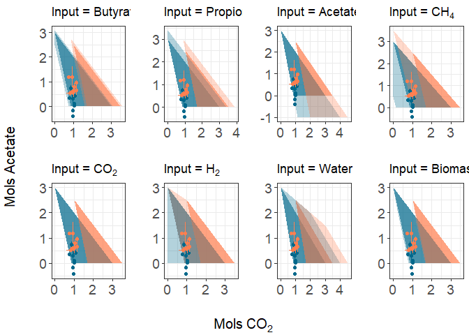

Figure 2b
---------

``` r
#compare amount of products between different fibers

metadata=rownames(gas_prod_9ppl_mean)
source=sapply(strsplit(metadata, "-"), `[`, 1)
fiber=sapply(strsplit(metadata, "-"), `[`, 2)
source=paste0('H',source)

metadata_fiber <- data.frame(source=source, fiber=fiber)
rownames(metadata_fiber)=metadata

gas_prod_9ppl_mean_mol_labels=data.frame(gas_prod_9ppl_mol)
gas_prod_9ppl_mean_mol_labels=gas_prod_9ppl_mean_mol_labels[,1:9]
gas_prod_9ppl_mean_mol_labels$source=source
gas_prod_9ppl_mean_mol_labels$fiber=fiber

reshape_gas_prod_9ppl_mean=melt(gas_prod_9ppl_mean_mol_labels,id=c('source','fiber'))
names(reshape_gas_prod_9ppl_mean)[3]=c('product')
reshape_gas_prod_9ppl_mean = reshape_gas_prod_9ppl_mean %>% filter(product %in% c('H2','CH4','CO2','Acetate','Butyrate','Propionate')) 


p=ggboxplot(reshape_gas_prod_9ppl_mean, x = "fiber", y = "value", xlab=NULL,ylab=NULL,
          color = "fiber", palette = "npg",outlier.shape = NA, add = "jitter",
          facet.by = "product", line.color = "gray", line.size = 0.4)+
  scale_y_continuous(limits = c(-0.5,2),expand = c(0, 0))+
          scale_color_manual(values = c('grey60','deepskyblue4','coral'),labels = c("Cellulose","Inulin",'Pectin'))+
          scale_x_discrete(labels=c('Cellulose','Inulin','Pectin'))
```

    ## Scale for 'colour' is already present. Adding another scale for 'colour',
    ## which will replace the existing scale.

``` r
my_comparisons <- list( c("Cell", "Inul"), c("Cell", "Pect"), c("Inul", "Pect") )

p=p+stat_compare_means(comparisons = my_comparisons,paired = T,label = "p.signif",tip.length = 0) +labs(y= "mol product/mol fiber",x=NULL)


p
```

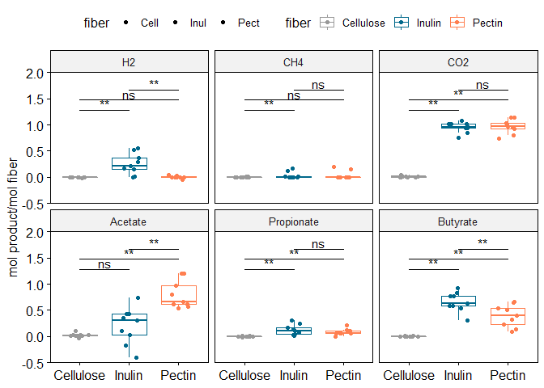

Figure 4,Figure S3
------------------

``` r
#PCoA of products
ps = phyloseq(otu_table(gas_prod_9ppl_mean_mol_labels[,1:7], taxa_are_rows=FALSE), 
              sample_data(metadata_fiber)) 
ps_2=subset_samples(ps, fiber!="Cell")
ps.ord <- ordinate(ps, "PCoA", "euclidean")
p1 = plot_ordination(ps, ps.ord, type="samples",color="fiber")+geom_label(label = source)+ scale_color_manual(values = c('grey60','deepskyblue4','coral'),labels = c("Cellulose","Inulin",'Pectin'))

p1+theme_bw()
```

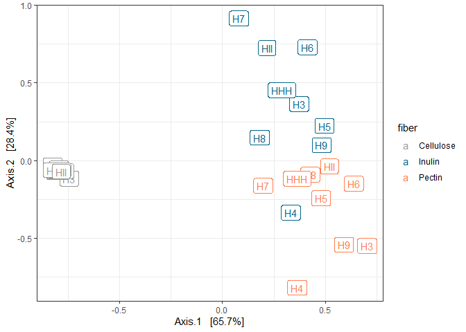

``` r
#PERMANOVA
permanova_products=adonis(otu_table(ps)~ fiber+source, data = metadata_fiber,method="euclidean")
ps_2_sample_data=as(sample_data(ps_2),"data.frame")
permanova_products_2=adonis(otu_table(ps_2)~ fiber+source, data = ps_2_sample_data ,method="euclidean")
coef <- coefficients(permanova_products_2)["fiber1",]
top.coef <- coef[rev(order(abs(coef)))]

par(mar=c(2,6,2,2))
barplot(sort(top.coef), horiz = T, las = 1, main = "Top products")
```


Figure S6a, S6b
---------------

``` r
#alpha and beta diversities of all ex vivo communities
metadata_1 = rownames(gas_9ppl)
subject=sapply(strsplit(metadata_1, "_"), `[`, 1)
fiber=sapply(strsplit(metadata_1, "_"), `[`, 2)
rep=sapply(strsplit(metadata_1, "_"), `[`, 4)

metadata_2 <- data.frame(subject=subject, fiber=fiber,rep=rep)
rownames(metadata_2)=rownames(gas_9ppl)

ps_9ppl = phyloseq(otu_table(gas_9ppl, taxa_are_rows=FALSE), 
              sample_data(metadata_2), 
              tax_table(taxa_table))

richness_measures=c("Observed", "Shannon")
p_alpha = plot_richness(ps_9ppl, x = "fiber",measures = richness_measures,color = "fiber")+geom_boxplot()+
  scale_color_manual(values = c('grey60','green','deepskyblue4','coral'))+theme_bw()

p_alpha
```

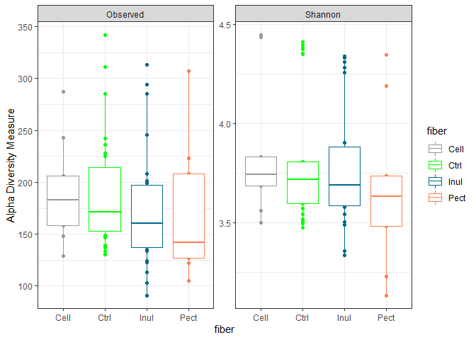

``` r
ps_9ppl_P = transform_sample_counts(ps_9ppl, function(x) x/sum(x))

ps_9ppl_dist = phyloseq::distance(ps_9ppl_P, method="bray")
ordination = ordinate(ps_9ppl_P, method="PCoA", distance=ps_9ppl_dist)
p_beta=plot_ordination(ps_9ppl_P, ordination, color="subject") + theme_bw()+
    geom_point(mapping = aes(shape = factor(fiber)))

p_beta
```


Figure 5a, S5
-------------

``` r
#Lasso regression for ASVs associated with net H2 production in inulin dataset
variable1 = as.character(get_variable(ps_9ppl_P, "subject"))
variable2 = as.character(get_variable(ps_9ppl_P, "fiber"))
sample_data(ps_9ppl_P)$subject_fiber <- mapply(paste, variable1, variable2,'GC', sep = "-")

ps_9ppl_P_Inu=subset_samples(ps_9ppl_P,fiber=='Inul')
otu_9ppl_P_Inu=otu_table(ps_9ppl_P_Inu)
combined_9ppl_P_Inu=cbind(otu_9ppl_P_Inu,sample_data(ps_9ppl_P_Inu))

combined_9ppl_P_Inu_merged=combined_9ppl_P_Inu %>% group_by(.dots=c('subject_fiber')) %>% 
  summarise_if(is.numeric, c(mean,sd), na.rm = TRUE) 

sample_with_gas_Inu=merge(combined_9ppl_P_Inu_merged,gas_prod_9ppl_mean,by.x='subject_fiber',by.y=0,sort=F)
sample_with_gas_Inu_sd=merge(sample_with_gas_Inu,gas_prod_9ppl_sd,by.x='subject_fiber',by.y = 0)
rownames(sample_with_gas_Inu_sd)=sample_with_gas_Inu_sd$Row.names
sample_with_gas_Inu_sd$Row.names=NULL


ASVs_Inu=as.matrix(sample_with_gas_Inu_sd[,2:(2+ncol(otu_9ppl_P_Inu))])
Inu_H2=sample_with_gas_Inu_sd$H2.x/sample_with_gas_Inu_sd$Fiber_uptake.x
Inu_H2_sd=sample_with_gas_Inu_sd$H2.y/sample_with_gas_Inu_sd$Fiber_uptake.x


#leave one out cross validation, one-by-one

coef_lasso_ASVs_Inu=matrix(NA,ncol=nrow(ASVs_Inu),nrow =ncol(ASVs_Inu)+1)
predict_lasso_ASVs_Inu=matrix(NA,nrow=nrow(ASVs_Inu))
Inu_H2_test=matrix(NA,nrow=nrow(ASVs_Inu))
for (i in 1:nrow(ASVs_Inu)){
  train_ind=c(1:nrow(ASVs_Inu))[-i]
  
  lasso_ASVs_Inu=glmnet(ASVs_Inu[train_ind,],Inu_H2[train_ind])    #the glmnet function standardizes the variables(x and y) automatically unless you turn it off; 
  #however, coefficients shown are unstandardized
  cv_fit <- cv.glmnet(x=ASVs_Inu[train_ind,], y=Inu_H2[train_ind], alpha = 1, nlambda = 1000)
  lasso_ASVs_Inu_fit=glmnet(x=ASVs_Inu[train_ind,], y=Inu_H2[train_ind], alpha = 1, lambda=cv_fit$lambda.1se)
  coef_lasso_ASVs_Inu[,i]=coef(lasso_ASVs_Inu_fit)[,1]
  predict_lasso_ASVs_Inu[i]=predict(lasso_ASVs_Inu_fit,ASVs_Inu[-train_ind,,drop=F]) 
  Inu_H2_test[i]=Inu_H2[-train_ind]
}


Inu_H2_test_predict=as.data.frame(cbind(Inu_H2_test,predict_lasso_ASVs_Inu)) 
names(Inu_H2_test_predict)=c('measured','predicted')

p_predict_Inu_H2=ggplot(Inu_H2_test_predict,aes(y=predicted,x=measured))+geom_point(color='deepskyblue4',pch=19,size=2)+geom_smooth(method = "lm",linetype=2,color='black',alpha=0.5)+theme_bw()+xlab('mol H2 observed/mol Inulin')+ylab('mol H2 predicted/mol Inulin')

p_predict_Inu_H2
```

    ## `geom_smooth()` using formula 'y ~ x'


``` r
coef_lasso_ASVs_Inu_select=coef_lasso_ASVs_Inu[which(rowSums(coef_lasso_ASVs_Inu)>0),]
#Since first row is intercept, we only look at the other two rows, and find that only the third row is in all leave one out regressions
l=(which(rowSums(coef_lasso_ASVs_Inu)>0)[3]-1)  #need to -1 since first row is intercept
lac_H2=data.frame(ASV=ASVs_Inu[,l],H2=Inu_H2,ASV_sd=sample_with_gas_Inu_sd[,(1+ncol(otu_9ppl_P_Inu)+l)],H2_sd=Inu_H2_sd)


ggplot(lac_H2,aes(x=ASV,y=Inu_H2))+geom_point(size=2)+
  geom_point(color='deepskyblue4',pch=19,size=2)+
  geom_errorbar(aes(ymax=Inu_H2+Inu_H2_sd,ymin=Inu_H2-Inu_H2_sd),width=0,color='deepskyblue4')+
  geom_errorbarh(aes(xmax=ASV+ASV_sd,xmin=ASV-ASV_sd),height=0,color='deepskyblue4')+
  theme_bw()+
  xlab('Relative Abundance(select Lachnospiraceae ASV)')+
  ylab('mol H2/mol inulin')
```

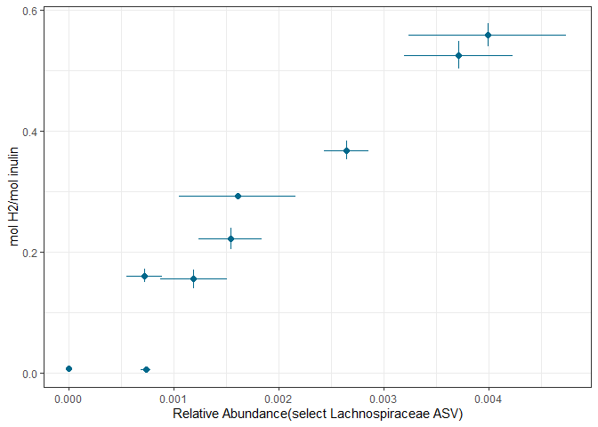

Figure 5b
---------

``` r
#Methane production vs. metanogen 
ps_9ppl_P_Methano=subset_taxa(ps_9ppl_P,Class=='Methanobacteria')
otu_9ppl_P_Methano_summed=rowSums(otu_table(ps_9ppl_P_Methano))
combined_9ppl_P_Methano=cbind(sample_data(ps_9ppl_P_Methano),otu_9ppl_P_Methano_summed)
names(combined_9ppl_P_Methano)[5]='Methano_conc'
combined_9ppl_P_Methano_merged=combined_9ppl_P_Methano %>% group_by(.dots=c('subject_fiber','fiber')) %>% summarise(mean_methano_conc=mean(Methano_conc),sd_methano_conc=sd(Methano_conc)) 


sample_with_gas=merge(combined_9ppl_P_Methano_merged,gas_prod_9ppl_mean,by.x='subject_fiber',by.y=0,sort=F)
sample_with_gas_sd=merge(sample_with_gas,gas_prod_9ppl_sd,by.x='subject_fiber',by.y = 0)
rownames(sample_with_gas_sd)=sample_with_gas_sd$Row.names
sample_with_gas_sd$Row.names=NULL


sample_with_gas_sd_no_cell=sample_with_gas_sd %>% filter(fiber!='Cell') %>% mutate(norm_CH4 = case_when(fiber=='Inul'~CH4.x/Fiber_uptake.x,fiber=='Pect'~CH4.x/Fiber_uptake.x),
          norm_CH4_sd = case_when(fiber=='Inul'~CH4.y/Fiber_uptake.x,fiber=='Pect'~CH4.y/Fiber_uptake.x))


ggplot(sample_with_gas_sd_no_cell,aes(x=mean_methano_conc,y=norm_CH4,color=fiber))+geom_point(size=2)+
  geom_errorbar(aes(ymax=norm_CH4+norm_CH4_sd,ymin=norm_CH4-norm_CH4_sd),width=0)+
  geom_errorbarh(aes(xmax=mean_methano_conc+sd_methano_conc,xmin=mean_methano_conc-sd_methano_conc),height=0)+
  theme_bw()+
  scale_color_manual(values=c('deepskyblue4','coral'),labels = c("Inulin", "Pectin"))+
  xlab('portion Methanobacteria detected')+
  ylab('mol methane/mol fiber')
```

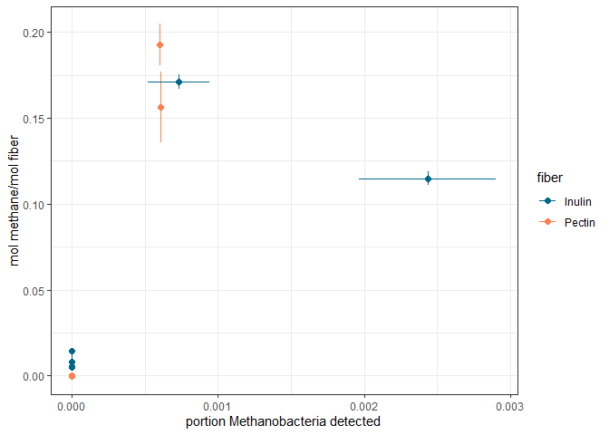

Figure S4
---------

``` r
#CHO ratio treatment/Control
marker = brewer.pal(6, "Paired")

treat_control_ratio=read.csv("control_treatment_ratio_CHO.csv")
names(treat_control_ratio)[1]='element'
p3=ggplot(treat_control_ratio)+
  geom_bar(aes(y=mean,x=element,fill=element),stat="identity",position = position_dodge(0.6), width=0.8,size=1,alpha=0.6)+
  geom_errorbar(aes(ymax = mean + sd, ymin = mean - sd,x=element,color=element),
                position =position_dodge(0.6), width=0.2,size=1)+
  scale_color_manual(values=marker)+
  scale_fill_manual(values=marker)+
  ylab('Ratio of control\n to treatment')+theme_bw()+ylim(c(0,1))


p3
```


